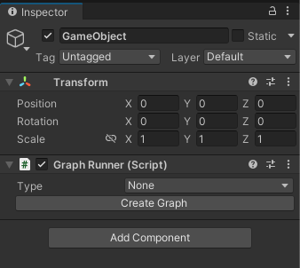
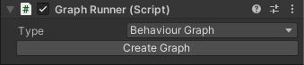
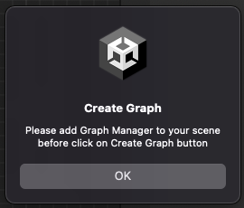
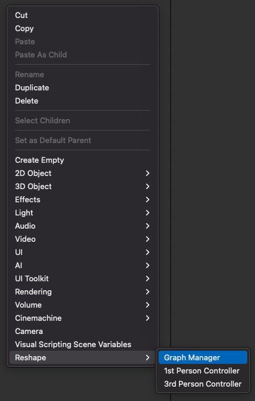
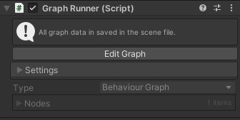
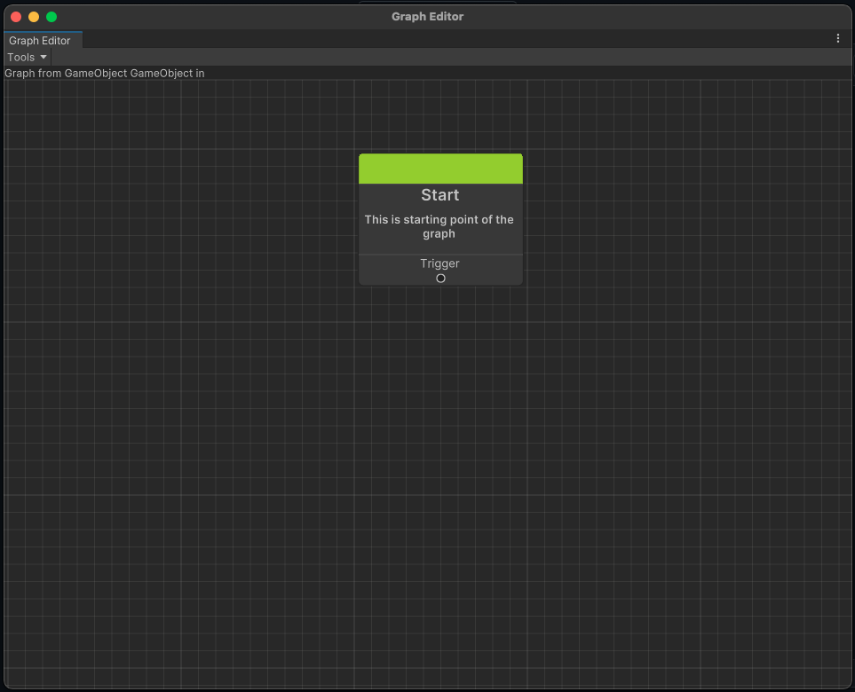
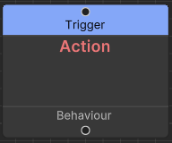
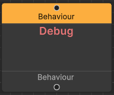
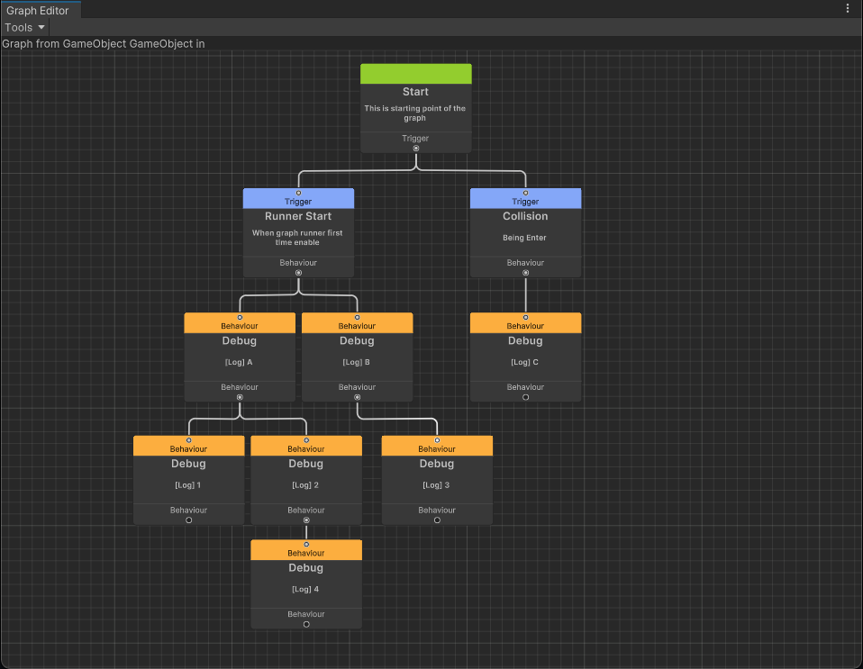
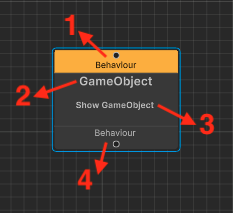

# Getting Started

1. [Setup Graph into GameObject](#setup-graph-into-gameobject)
2. [Editing Graph](#editing-graph)
3. [Graph Node](#graph-node)
4. [Demo Sample](#demo-sample)
 
## Setup Graph into GameObject 

Add Graph Runner component into any gameObject.  
  

Select Type "Behaviour Graph" then click on Create Graph button.  
  

If the scene not yet have Graph Manager, below warning message will prompted.  
  

Close the warning then right mouse click on Project windows to create Graph Manager.  
  

Once added Graph Manager into scene, cilck on Create Graph button again at the Graph Runner component.  
  

You will see "Edit Graph" button after success create graph. Click on "Edit Graph" to open Graph Editor.
  

## Editing Graph 

Graph Editor is a window for editing the graph, everything about the graph is configure at here.  
Graph always have a Start node and this node cannot be remove.  
You could hold middle mouse button to move graph viewing position, scroll middle mouse wheel to zoom in/out graph viewing size.  
  

Right mouse click in the Graph Editor to add more nodes into the graph.  
Trigger node and Behaviour node are basic type of nodes you always use.  
   

Graph is design to execute node base on trigger driven waterfall method.  
Start node can connect to multiple trigger nodes, Trigger node can connect to multiple behaviour nodes, Behaviour node can connect to multiple behaviour nodes.  
If Trigger node get executed then all behaviour nodes under it get executed base on left to right, top to bottom order.
  
Above graph will log message to Console window when runner get active at the first time.  
Log message will appear base on this order : A, 1, 2, 4, B, 3
Log message 'C' will appear when a rigidbody enter into collider that exist at the same gameObject with graph runner.

## Graph Node

Graph Node is combine of 4 section : Input Port, Name, Description and Output Port  
  
### Section 1 : Input Port
Serve as Input port, it only allow one node connecting to it.  
It show what type of node that it allow connecting.
### Section 2 : Name
Display the node type name
### Section 3 : Description
Display the functionality of the node
### Section 4 : Output Port
Serve as Output port, it can connect to multiple nodes.  
It show what type of node that it can connect to.

## Demo Sample

There are plenty of graph demo in the sample that you could import from ReGraph package.  
Once imported samples, run LabMain scene to try out the demo, as well as check out how each graph have setup.  
