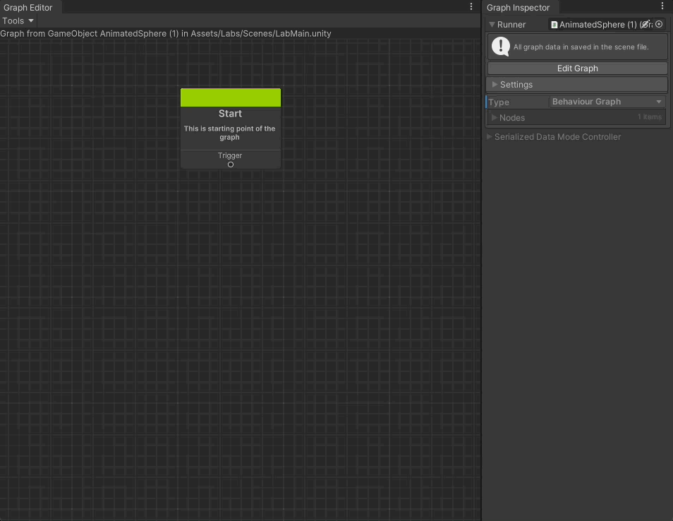

# ReGraph

A user-friendly trigger driven behaviour tree in Unity.
It is develop base on the objective of making a tool that allow designer & artist create game with minimum coding effort.



> __IMPORTANT__: 
> 
> Currently it is still under development with no guarantee on completion date.
> 
> You are welcome to evaluate the tool and give feedbacks.
> 
> Beware the risk when use on your game production project.


## Requirements
* [Unity](https://unity3d.com/get-unity/download/archive) version 2022.2.1f1 and above. Older versions may work but were not tested.

## Pre-require package  
* [Odin - Inspector and Serializer](https://assetstore.unity.com/packages/tools/utilities/odin-inspector-and-serializer-89041) version 3.1.4 or higher
* Packages from [Package Manager](https://docs.unity3d.com/2022.2/Documentation/Manual/upm-ui.html) : 
  - [Input System](https://docs.unity3d.com/Packages/com.unity.inputsystem@1.4/manual/Installation.html) (v1.4.4 or higer)
  - [TextMesh Pro](https://docs.unity3d.com/Packages/com.unity.textmeshpro@3.0/manual/index.html#installation) (v3.0.6 or higer)
  - [Cinemachine](https://docs.unity3d.com/Packages/com.unity.cinemachine@2.3/manual/CinemachineGettingStarted.html#installing-cinemachine) (v2.9.5 or higer)
  - [AI Navigation](https://docs.unity3d.com/Packages/com.unity.ai.navigation@1.1/manual/UpgradeGuide.html) (v1.1.1 or higer)

## How To Install 
* Import Input System, TextMesh Pro, Cinemachine and AI Navigation to your project via [Package Manager Unity Registry](https://docs.unity3d.com/2022.2/Documentation/Manual/fs-install.html)
* Import Odin - Inspector and Serializer to your project via [local .unitypackage](https://docs.unity3d.com/2022.2/Documentation/Manual/AssetPackagesImport.html)
* Import ReGraph to your project via [Package Manager Git URL](https://docs.unity3d.com/2022.2/Documentation/Manual/upm-ui-giturl.html)
```
https://github.com/ReshapeGames/ReGraph.git#upm
```
* Setup License follow instruction from [LICENSE](LICENSE.md)

## FAQ

<details>
<summary>Why develop this tool ?</summary>
In the game community that I am involved, I notice many game projects not able to make a progress due to lack of game programmers in the team. My wish is the tool can power more projects to make a progress.
</details>

<details>
<summary>Is the tool actively under development ?</summary>
Yes, 0.2.2 release mark the completion of milestone 1 which barely good enough to support development for treassure hunting and room escape game genres. More features is queuing up in the plan in order to make the tool powerful enough to develop various types of games. Unfortunately the tool is develop by a solo developer, the progress will be slow.
</details>

<details>
<summary>Is the tool free of charge ?</summary>
At the moment you are free to use the license key share in LICENSE.md. Down the road, I wish to receive some financial support from the licensing. Right now I am developing it solo and not receive any financial income from this tool.
</details>

<details>
<summary>Is the tool stable to be use ?</summary>
I have tested the tool as much as I can, unfortunately as a solo developer, I might missed out some testing at certain use case. <br/>
You are advice not to use it on your gamr production unless you are fully understand the risk.
</details>

<details>
<summary>How do I receive support when I facing a difficulty ?</summary>
Please use the Issues tab, post any bugs you found, any advice you would like to comment. Your voice will definitely being hear. <br/>
Join the Discord Server (https://discord.gg/QzDmqcYq) to get direct in touch with the community and developers.
</details>

<details>
<summary>Why not using ScriptableObject for the graph setup ?</summary>
Not making Graph / Graph Node as ScriptableObject because I would like to streamline scene's GameOject usage in the graph. Letting game designer or game artist directly drag scene's GameObject / Compoenent into Graph Node have reduce the step of creating scene variabbles.
</details>

## More information

Check out the [Documentation](Documentation~/) folder for more information. <br/>
In particular, the [Getting Started Guide](Documentation~/GettingStarted.md) is a good place to start. <br/>
Check out [ChangeLog](CHANGELOG.md) to take a look on each release build changes.

## Special Thanks
* [TheKiwiCoder](https://thekiwicoder.com/behaviour-tree-editor/) for release the FREE Behaviour Tree Editor. 
* [Demigiant](http://dotween.demigiant.com) for release the FREE DOTween. 
* https://game-icons.net/ for free icon tools
* https://mixkit.co/free-stock-music/ for free music

## Donate

For kind hearted, you could buy me a coffee to cheer me up on my journey! <br/>
Ehereum Mainnet Wallet 
```
0xc43F5b080FFed418758B720645250c4E4C33AE15
```
